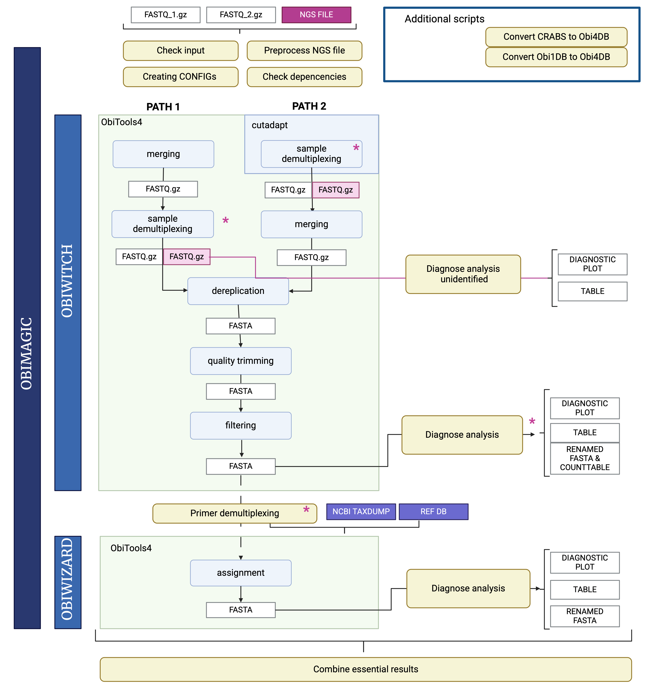

# ObiMAGIC v0.1


This publication to this manuscript is submitted to Molecular Ecology Resources. If you are using this pipeline, please cite the papers & preprint listed in the [Citation](#Citation).  
The sequencing test data set is uploaded to FigShare: https://doi.org/10.6084/m9.figshare.28700555; including the reference database: https://doi.org/10.6084/m9.figshare.28700570.

[Description](#Description)  
[Setup and dependencies](#Setup-and-dependencies)   
[Execution with and without Slurm](#Execution-with-and-without-Slurm)  
[Usage](#Usage)  
[Demultiplexing file](#Demultiplexing-file)  
[Config files](#Config-files)  
[Troubleshooting](#Troubleshooting)  
[Citation](#Citation)  

## Description
ObiMAGIC (**M**etabarcoding **A**nalysis **G**uidance **I**ntegration **C**ontrol) is a pipeline designed for processing of metabarcoding read data with [ObiTools4](https://git.metabarcoding.org/obitools/obitools4/obitools4).  
The pipeline basically performs these steps:
1. Preprocessing demultiplexing file for obitools
2. ObiWitch read preprocessing and filtering
3. Splitting samples according to markers (sample demultiplexing)
4. ObiWizard assignment
5. Create tar archives containing relevant results

It consists of two sub-pipelines: ObiWitch (merging, sample demultiplexing and further filtering) and ObiWizard (taxonomic assignment).


Fig.1: Graphical overview of ObiMAGIC containing two major steps separated into two sub-pipelines: 1.) ObiWitch includes demultiplexing, merging, dereplication and filtering. Please note the two different paths, which define the order of merging and sample demultiplexing. 2.) ObiWizard performs taxonomic assignment of ASVs. Asterisks highlight input of the demultiplexing file. Figure is created with Biorender.

Mandatory input files are forward and reverse Illumina reads and corresponding demultiplexing file(s). All further options and parameters are optional and have default values.

## Setup and dependencies

The pipeline was tested with perl 5.30.0, R 4.3.1, ObiTools 4.2.0 (86d208f) and Cutadapt versions 3.7 and 5.0.  
Find a detailed list of expected executables in [setup_and_dependencies.md](setup_and_dependencies.md).

### Mandatory softwares and tools:  
- [Obitools](https://git.metabarcoding.org/obitools/obitools4/obitools4)
  - Make sure to install Obitools4 with the prefix `obi4_` for example with this command:  
    ```
    curl -L https://metabarcoding.org/obitools4/install.sh |  bash -s -- --install-dir /my/system/ObiTools4/ --obitools-prefix obi4_
    ```
    or from [Github](https://github.com/metabarcoding/obitools4)
    ```
    curl -L https://raw.githubusercontent.com/metabarcoding/obitools4/master/install_obitools.sh | bash -s -- --install-dir /my/system/ObiTools4/ --obitools-prefix obi4_
    ```


- [bash](https://tiswww.case.edu/php/chet/bash/bashtop.html): `bash`
- [Perl](https://www.perl.org/) and perl modules: `perl`
  - First test, if following perl modules are installed with [00_ObiHelp_perl_control.pl](00_ObiExtra/00_ObiHelp_perl_control.pl):
    ```
    perl 00_ObiHelp_perl_control.pl
    ```
    If the script returns an error please install the missing perl modules e.g. with:
    ```
    cpanm List::MoreUtils
    ```
- [R](https://cran.r-project.org/) and R libraries: `Rscript`
  - All R libraries can be easily installed with [`00_ObiHelp_R_install.R`](00_ObiExtra/00_ObiHelp_R_install.R)
    ```
    Rscript 00_ObiHelp_R_install.R
    ```
- [pigz](https://zlib.net/pigz/): `pigz`
- [NCBI's new taxonomy files](https://ncbiinsights.ncbi.nlm.nih.gov/2018/02/22/new-taxonomy-files-available-with-lineage-type-and-host-information/):  
  Taxonomic assignment depends on NCBI's `new_taxdump`.  
  Download the arcive and uncompress it, e.g. like  
  ```
  mkdir new_taxdump
  cd new_taxdump
  wget https://ftp.ncbi.nlm.nih.gov/pub/taxonomy/taxdump.tar.gz
  tar xf taxdump.tar.gz
  cd ..
  ```
  The taxdump directory needs to be specified with the option `-new-taxdump` or in [`config_ObiWizard.ini`](00_ObiScripts/config_ObiWizard.ini):
  ```
  tax_path_to_file="/my/system/new_taxdump"
  ```
- ObiMAGIC scripts: download the [latest release](LINK_TO_LATEST_RELEASE) or use `git clone https://github.com/jromahn/ObiMAGIC.git`

__Mandatory executable for pipeline path 2 only:__
- [Cutadapt](https://cutadapt.readthedocs.io/en/stable/): `cutadapt`

### Setup of `$PATH`
The environment variable `PATH` stores a list of directories where the system searches for executable files. If set up correctly, executables in these directories can be called from every location in your system without specifying an absolute or relative path.  
`00_ObiMAGIC_main.pl`, `01_ObiWitch_main.sh` and `03_ObiWizard_main.sh` will search for depending executables and scripts in your `$PATH`.  
To setup `$PATH` run the following command from the root directory of this repository:
```
export PATH=$PATH:$(realpath $(pwd)):$(realpath $(pwd)/00_ObiScripts):$(realpath $(pwd)/00_ObiExtra)
```
This ensures the scripts can be found by `00_ObiMAGIC_main.pl`, `01_ObiWitch_main.sh` and `03_ObiWizard_main.sh` as well as they can be executed from any location.

## Execution with and without Slurm

ObiMAGIC will submit internal processes (like ObiWitch and ObiWizard) via Slurm, if `sbatch` detected and not switched off by the user with `-no-slurm`. Furthermore, ObiMAGIC will submit ObiWizard assignments via a Slurm job array, which will assure most parallel processing of multiple taxonomic assignments. If Slurm is not detected or the user switches off submission via Slurm, all commands will be executed locally and taxonomic assignments by ObiWizard will be executed consecutively to prevent RAM limitations on smaller computing devices.

## Usage

### ObiMAGIC
To run ObiMAGIC with default settings, fastq files and demultiplexing file must be specified from the command line. Otherwise, modify the configuration file and specify the path to the configuration file on the command line.

The pipeline expects the `config_db.tsv` in the same folder like the `00_ObiMAGIC_main.pl`, otherwise you have to define the path to this configuration file. 
```
	00_ObiMAGIC_main.pl -ngs <demultiplexing file> -fq <paired_1.fq.gz,paired_2.fq.gz> -pipeline-path {1,2}
	                   [-project <custom project name> -db-config <custom database conig>
	                    -o <output directory> -t <number of threads> -slurm-mem <slurm memory>
	                    -slurm-opts "<option1> [<option2> ...]"]

Mandatory:
	Mandatory options -ngs and -fq can be specified multiple times
	-ngs STR		Demultiplexing file containing primer, sample ID and tag information
	-fq STR			Paths to two fastq files containing paired Illumina reads comma separated

Options: [default]
	-pipeline-path {1,2}	Specify the order of merging and sample demultiplexing [1]
				1: Run first merging and second sample demultiplexing
				2: Run first sample demultiplexing and second merging
	-project STR		Specify a custom project name
				[first part of project ID in first specified demultiplexing file]
	-obiwitch-config STR	Custom config file for obiwitch
				[00_ObiScripts/config_ObiWitch.ini]
	-obiwizard-config STR	Custom config file for obiwizard
				[00_ObiScripts/config_ObiWizard.ini]
	-db-config STR		TSV file specifying primer database combination
				[config_db.tsv]
	-new-taxdump STR	Custom path to NCBI's new_taxdump directory. Overrides default from
				-obiwizard-config [new_taxdump]
	-primer STR		Set a primer name when not present in the demultiplexing file. Does not override
				primer name in demultiplexing file. Only allowed when one demultiplexing file is specified.
				Possible values have to be defined in config_db.tsv
	-o STR			Output directory [.]
				Will be created if not existing
	-keep-tmp		Do not delete concatenated fastq files [off]
	-t INT			Number of threads [10]
	-slurm-mem STR		Memory that will be allocated by sbatch (--mem) [10G]
	-slurm-opts STR		Options that will be passed to sbatch
				--cpus-per-task is set according to -t
				--mem is set according to -slurm-mem
				[--cpus-per-task=10 --mem=10G --output %x-%N-%j.log --error %x-%N-%j.err --export=PATH=$PATH]
				Pass options with quotes: -slurm-opts "<option1> <option2>"
	-no-slurm		Do not submit internal processes via slurm if sbatch is detected [off]
	-v			Print executed commands to STDERR [off]
	-dry-run		Only print commands to STDERR instead of executing [off]

	-h or --help		Print this help and exit
	-version		Print version number and exit

```
### ObiWitch

To run ObiWitch with default settings, fastq files, demultiplexing file and project name must be specified from the command line. Otherwise, modify the configuration file and specify the path to the configuration file on the command line.

```
Usage: 01_ObiWitch_main.sh -ngs <NGS_file> -fq <paired_1.fq.gz,paired_2.fq.gz> -project <custom_project_name> -obiwitch-config <config_file> -o <path_to_result>

Options:
	  -fq <file1,file2>   			Paths to two fastq files containing paired Illumina reads comma sperated
	  -ngs <demultiplexing_file>   		Specify the demultiplexing file containing primer, sample ID and tag information
	  -obiwitch-config <config_file>        Custom config file for obiwitch if you want to modify the settings
	  -project <project_name>		Specify projects name
	  -o <path_to_result>   		Path where all results should be stored, Default: working directory
	  -version    				Show ObiWitch version and exit
	  -h, --help    			Show this help message and exit
```


###  ObiWizard

To run ObiWizard with default settings, either edit the configuration file and specify the path to the configuration file on the command line. Otherwise, specify the primer short name, the path to the obitools formatted fasta file (including the original obitools ASV names), the path to the reference database and the taxdump files on the command line.

```
Usage: 03_ObiWizard_main.sh -input <obitools_final.fasta> -identifier <primer> -obiwizard-config <config_file> -ref <reference_database> -new-taxdump <NCBI_taxdump>

Options:
	  -input <obitools_final.fasta>   	Paths to obitools formated fasta file
	  -identifier <primer>   		Specifiy the primer name
	  -obiwizard-config <config_file>       Custom config file for obiwitch if you want to modify the settings
	  -ref <reference_database>   		Path to reference database for assigning
	  -new-taxdump <NCBI_taxdump>   	Custom path to NCBI's new_taxdump directory
	  -version    				Show ObiWitch version and exit
	  -h, --help    			Show this help message and exit
```


## Demultiplexing file

The NGS demultiplexing file (short demultiplexing file) is a text file, which contains information on primer, sample ID, used tags and primer sequences amongst others (see below) in columns. The columns can be separated by comma (`,`), semicolon (`;`), more than one space (`  `), tab (`\t`).

__Format__  
File structure is based on ObiTools ngsfiles with modifications and recommendatations. The demultiplexing file contains following information in the respective columns (see detailed examples below):
1. Project ID: A recognizable name for your project.
2. Primer ID (optional) and sample ID
   - Primer and sample name have to be separated by two underscores (`__`), therefore `__` is allowed only once in this column. For example: `Euka02__SED22_0001_R01` ( Primer__Sample_SampleNo_ReplicateNo)
   - Sample names should include information about sample type like negative control, positive control or actual sample (see Suppl). The sample name contains separated with one underscore (`_`) project name, sample number, plate or replicate number. For example: `SED22_0001_R01` (Sample_SampleNo_ReplicateNo)
3. Tag combination separated with colon
4. Forward primer sequence 
5. Reverse primer sequence
6. Plate number and well position (optional)
   - If plate design information is provided in the extra information column, it has to be provided according to the following structure: position=PlateNo_ColumnRow e.g.= "position=01_01A" for plate number 1 in well 1A. For more general information see this [detailed description](NGS_file_format.md) and the Obitools4 manual.

__Examples__  
Ngsfiles can have table headers as a first row but this has to start with `#`. The content of the demultiplexing file is shown in a table because of better readability.  

Find an example of an demultiplexing file without a primer name in column 2 below. In this case specify the primer name with `-primer` on the ObiMAGIC command line.
| `#Project ID` | `Sample ID` | `Tags` | `Forward primer` | `Reverse primer` | `Extra info` |
| --- | --- | --- | --- | --- | --- |
| `project_name` | `S22MN_0001_P01` | `acacacac:acacacac` | `TTTGTCTGSTTAATTSCG` | `CACAGACCTGTTATTGC` | `F @ position=01_01A` |
| `project_name` | `S22PP_0001_P01` | `acagcaca:acacacac` | `TTTGTCTGSTTAATTSCG` | `CACAGACCTGTTATTGC` | `F @ position=01_01B` |
| `project_name` | `S22PP_0002_P01` | `gtgtacat:acacacac` | `TTTGTCTGSTTAATTSCG` | `CACAGACCTGTTATTGC` | `F @ position=01_01C` |

This is an example of an demultiplexing file including a primer name in column 2. Please note the primer name `Euka02` before the double underscore (`__`). No primer name needs to be specified on the ObiMAGIC command line in this case.
| `#Project ID` | `Sample ID` | `Tags` | `Forward primer` | `Reverse primer` | `Extra info` |
| --- | --- | --- | --- | --- | --- |
| `project_name` | `Euka02__SED22_0001_R01` | `acacacac:acacacac` | `CGCCACCGGT` | `GGAGGATGCA` | `F @ position=01_01A` |
| `project_name` | `Euka02__SED22_0001_R02` | `acacacac:acacacac` | `CGCCACCGGT` | `GGAGGATGCA` | `F @ position=01_01A` |
| `project_name` | `Euka02__SED22_0001_R03` | `acacacac:acacacac` | `CGCCACCGGT` | `GGAGGATGCA` | `F @` |

The primer ID is optional but essential in the demultiplexing file if the same samples in a sequencing pool have been amplified with different primer pairs/markers (e.g. `Euka02__SED22_0001_R01` and `COI__SED22_0001_R01`). 

__Primer__  
A primer name is needed to run taxonomic assignment with the correct and corresponding database. There are multiple ways to provide the primer name:
1. In the demultiplexing file:
   a. A column containing the primer name before the Primer and sample ID column (2 columns before the tag column).
   b. In the sample ID column in front of the sample ID separated with double underscore (`Primer__sampleID`)
2. Parsing the primer name with `-primer`. If the primer name is not contained in the demultiplexing file, the user can specify the primer name. This is only possible if a single demultiplexing file is specified as input for `00_ObiMAGIC_main.pl`.

Be aware that the pipeline (more prcisely `00_ngs_rm-cols_placeholder.pl`) will error exit if no primer name is provided in the demultiplexing file neither by `-primer`.

## Configuration files
__ObiWitch__  

Find an example of an ObiWitch config file and a brief explanation of the parameters as comments in [`config_ObiWitch.ini`](00_ObiScripts/config_ObiWitch.ini). As long as `00_ObiMAGIC_main.pl` is executed, the user does not create the ObiWitch config file manually. Everything in a line after with `#` is ignored.  

__ObiWizard__  

Find an example of an ObiWizard config file and a brief explanation of the parameters as comments in [`config_ObiWizard.ini`](00_ObiScripts/config_ObiWizard.ini). As long as `00_ObiMAGIC_main.pl` is executed, the user does not create the ObiWizard config file manually. Everything in a line after with `#` is ignored.

__Databases__  
[`config_db.tsv`](00_ObiScripts/config_db.tsv) contains tab separated the primer name and the relative path (from `00_ObiMAGIC_main.pl`) to the corresponding database in fasta format.  
The reference database must be in OBITools (version 4) format. The pipeline includes an indexing step, which can be time-consuming. Therefore, reusing previously indexed databases is recommended. The resulting indexed files are identifiable by the  `.indexed.` in their filenames.However, re-indexing is necessary if OBITools or the associated NCBI taxdump has been updated. 

The dirctory `00_ReferenceDB` already contains a database for the primer Euka02. `config_db.tsv` contains the correct information and is ready to use.  
Define custom databases by adding a new line to `config_db.tsv` containing tab separated the new primer name and the relative path to the database fasta file. 
The pipeline expects `config_db.tsv`  to be in the root directory of ObiMAGIC, otherwise you have to parse the full path of `config_db.tsv` to `00_ObiMAGIC_main.pl` via `-db-config`.
This is an example containing the provided primer "Euka02" and the custom primer "myPrimer":

| | |
| --- | --- |
| Euka02 | 00_ReferenceDB/EMBL_CRABS_database_Aug24.fasta |
| myPrimer | 00_ReferenceDB/myPrimer.fasta |


## Troubleshooting
`00_ObiMAGIC_main.pl` checks user input as well as pipeline and dependency setup comprehensively, which should reduce errors from all parts of the pipeline.  
__Exit codes__  
`00_ObiMAGIC_main.pl` checks user input and setup comprehensively, which should reduce errors of Obiwitch and Obiwizard.  
In case these parts of the pipeline fail, `00_ObiMAGIC_main.pl` will show the exit code of the respective command. Refer to these exit codes next to the error messages:  
- `1`: Demultiplexing file does not exist.
- `2`: Sequencing fastq files do not exist.
- `3`: Demultiplexing file and sequencing fastq files do not exist.
- `4`: No output files after demultiplexing (Path2). Possible issues with demultiplexing file.
- `5`: Merging forward and reverse reads was not successful.
- `6`: Removing not overlapping sequences was not successful or all sequences were removed. Check amplicon length and sequencing depth.
- `7`: No output files after demultiplexing (Path1). Possible issues with demultiplexing file.
- `8`: Demultiplexing file does not exist. Last check before downstream processing.
- `9`: Dereplication was not successful.
- `10`: Cleaned dereplicated file does not exist or is empty.
- `11`: Parameter FLAG_length and/or FLAG_count are set wrong. Specify "Y" or "N".
- `12`: Input file for length/count filtering does not exist or is empty.
- `13`: Input file for preparing final fasta file does not exist or is empty.
- `14`: ObiWitch diagnostic plot was not created.
- `42`: Config file does not exist.
- `66`: ObiWitch: ASVs are lost in the dereplication step. Two possible problems: RAM was too small or storage was to small.
- `666`: ObiWizard: Sequences are lost in the assignment. Possible problems: RAM was too small, storage was to small or something is wrong with the sequencing length.

## Citation

__If you use this tool please cite the preprint and dependencies:__

- ObiMAGIC:  
Romahn, J., Schell, T., Bálint, M. (in prep.). ObiMAGIC - Metabarcoding Analysis Guidance Integration Control Pipeline for ObiTools4.
- Obitools:  
Boyer, F., Mercier, C., Bonin, A., Le Bras, Y., Taberlet, P., & Coissac, E. (2016). obitools: A unix‐inspired software package for DNA metabarcoding. Molecular ecology resources, 16(1), 176-182. <https://doi.org/10.1111/1755-0998.12428>
- Cutadapt:  
Martin, M. (2011). Cutadapt removes adapter sequences from high-throughput sequencing reads. EMBnet. journal, 17(1), 10-12. <http://dx.doi.org/10.14806/ej.17.1.200>
- R: 
Run `citation("NAME-OF-R-LIBRARY")` in `R` to get the correct citation for your `R` version. It should look e.g. like:  
R Core Team (2020). R: A language and environment for statistical computing. R Foundation for Statistical Computing, Vienna, Austria. URL https://www.R-project.org/.
- R packages: 
  - Aphalo, P. J. (2024). Ggpmisc: Miscellaneous extensions to ’ggplot2’. https://CRAN.R-project.org/package=ggpmisc
  - Bache, S. M., & Wickham, H. (2022). Magrittr: A forward-pipe operator for r. https://CRAN.R-project.org/package=magrittr
  - Coissac, E. (2024). ROBIFastread: Provides function for manipulating fasta files following the OBITools4 standard. https://git.metabarcoding.org/obitools/obitools4/robireadfasta.git
  - Cooley, D. (2022). Jsonify: Convert between ’r’ objects and javascript object notation (JSON). https://CRAN.R-project.org/package=jsonify
  - Kassambara, A. (2023). Ggpubr: ’ggplot2’ based publication ready plots. https://CRAN.R-project.org/package=ggpubr
  - Oksanen, J., Simpson, G. L., Blanchet, F. G., Kindt, R., Legendre, P., Minchin, P. R., O’Hara, R. B., Solymos,P., Stevens, M. H. H., Szoecs, E., Wagner, H., Barbour, M., Bedward, M., Bolker, B., Borcard, D.,Carvalho, G., Chirico, M., Caceres, M. D., Durand, S., . . . Weedon, J. (2024). Vegan: Communityecology package. https://CRAN.R-project.org/package=vegan
  - Scott Chamberlain & Eduard Szocs. (2013). Taxize - taxonomic search and retrieval in r. F1000Research.https://f1000research.com/articles/2-191/v2
  - Sherrill-Mix, S. (2023). Taxonomizr: Functions to work with NCBI accessions and taxonomy. https://CRAN.R-project.org/package=taxonomizr
  - Sievert, C. (2020). Interactive web-based data visualization with r, plotly, and shiny. Chapman; Hall/CRC.https://plotly-r.com
  - Wilke, C. O. (2024). Cowplot: Streamlined plot theme and plot annotations for ’ggplot2’. https://CRAN.R-project.org/package=cowplot
  - Wilkins, D. (2023). Treemapify: Draw treemaps in ’ggplot2’. https://CRAN.R-project.org/package=treemapify
  - Wickham, H., Averick, M., Bryan, J., Chang, W., McGowan, L. D., Fran¸cois, R., Grolemund, G., Hayes, A.,
  - Henry, L., Hester, J., Kuhn, M., Pedersen, T. L., Miller, E., Bache, S. M., M¨uller, K., Ooms, J., Robinson, D., Seidel, D. P., Spinu, V., . . . Yutani, H. (2019). Welcome to the tidyverse. Journal of Open Source Software, 4 (43), 1686. https://doi.org/10.21105/joss.01686
